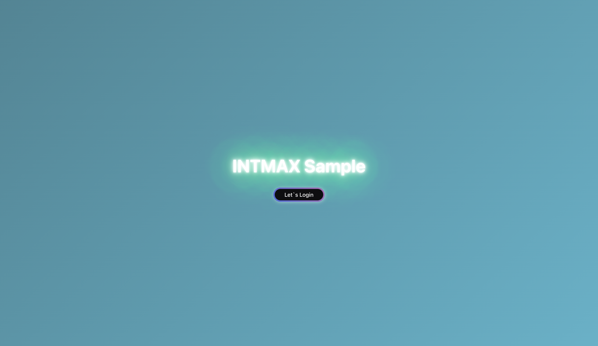
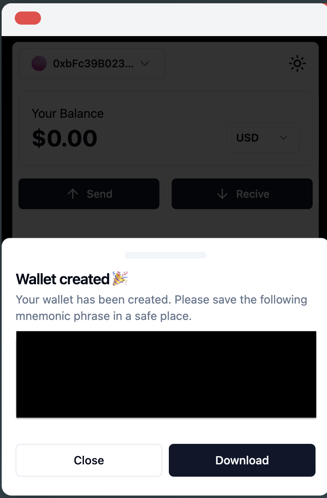

# IntmaxRepo

ステートレスなロールアップ INTMAX および INTMAX Wallet を調査・学習するためのリポジトリです。

[](https://github.com/mashharuki/IntmaxRepo/actions/workflows/ci.yml)  
[](https://app.netlify.com/sites/intmaxwalletrepo/deploys)

## INTMAX Wallet SDK 用のサンプルアプリ起動方法

- リポジトリをクローンしてくる。

  ```bash
  git clone https://github.com/mashharuki/IntmaxRepo
  ```

- 事前準備

  1.  Scroll Sepolia の faucet を取得すること

      以下サイトで取得できます。

      - [learnweb3 Faucet](https://learnweb3.io/faucets/)
      - [ETHGlobal faucet](https://ethglobal.com/faucet)
      - [Scroll が紹介している faucet 用のサイト](https://docs.scroll.io/en/user-guide/faucet/)

      以上にアクセスして Faucet を取得すること！！

  2.  ScrollScan の API を取得すること

      デプロイしたコントラクトを Verify するのに使うので以下サイトにアクセスして API キーを作成する。

      [ScrollScan API Key](https://scrollscan.com/myapikey)

      

  3.  OpenZepplin Defender にログインして ScrollSepolia 上で Relayer を作成し、API キーを取得すること。

      [OpenZeppelin Defender Relayer](https://defender.openzeppelin.com/v2/#/manage/relayers)

      

  4.  上記で作成した Relayer のウォレットアドレスに少額の ETH を送金する(Scroll Sepolia 上で送金してください！！)。

      [OpenZeppelin Defender で作成した Relayer アドレス - ScrollScan](https://sepolia.scrollscan.dev/address/0x1B38AB190EDf2bb4BcB2EC0b6639426731861581)

      

      各作成した Relayer のアドレスが表示されているはずなのでそのアドレスに入金すること

  5.  環境変数の設定

      環境変数は`backend`と`frontend`でそれぞれ設定する。

      - backend 側の環境変数の設定

        `.env`ファイルを`backend`フォルダ配下に作成する。

        そして以下の環境変数を設定する。

        ```txt
        PRIVATE_KEY=
        SCROLLSCAN_API_KEY=
        DEFENDER_API_KEY=
        DEFENDER_SECRET_KEY=
        ```

        `PRIVATE_KEY`は Metamask からコピペしてくる。

        `SCROLLSCAN_API_KEY`と`DEFENDER_API_KEY`と`DEFENDER_SECRET_KEY`は上記で取得してきたものを貼り付ける。

      - frontend 側の環境変数の設定

        `.env.local`ファイルを`frontend`フォルダ配下に作成する。

        そして以下の環境変数を設定する。

        ```txt
          NEXT_PUBLIC_APP_ICON="https://intmaxwallet-sdk-wallet.vercel.app/vite.svg"
          NEXT_PUBLIC_WALLET_URL="https://intmaxwallet-sdk-wallet.vercel.app/"
          NEXT_PUBLIC_RPC_URL="https://sepolia-rpc.scroll.io/"
          DEFENDER_API_KEY=
          DEFENDER_SECRET_KEY=
        ```

        `DEFENDER_API_KEY`と`DEFENDER_SECRET_KEY`は上記で取得してきたものを貼り付ける。

- インストール

  ```bash
  yarn
  ```

- スマートコントラクトのコンパイル

  ```bash
  yarn backend compile
  ```

- スマートコントラクトのテスト

  ```bash
  yarn backend test
  ```

- スマートコントラクト　デプロイ

  ```bash
  yarn backend deploy --network scrollSepolia
  ```

  デプロイされたコントラクトのアドレスは、`pkgs/backend/outputs/contracts-scrollSepolia.json`に記載されます。

  もしデプロイがうまくいかないという場合には以下のデプロイ済みコントラクトのアドレスを使ってみてください！

  デプロイ済みコントラクト(ScrollSepolia)

  [SampleForwarder](https://sepolia.scrollscan.com/address/0x32F9d19A89b65F91da684ee25136CF692673A160#code)

  [HelloWorld](https://sepolia.scrollscan.com/address/0x5e86a9F80E4Dec74573fe75F62090Cb28a1B5760#code)

- フロントエンドの定数ファイルの値を更新する。

  `pkgs/frontend/src/utils/constants.ts`でコントラクトのアドレスを設定しているので、上記でデプロイしたコントラクトのアドレスに更新します。  
  ※ デプロイがうまく行かないようであれば、すでに貼り付けてある値をそのまま使用してください。

  ```ts
  export const FORWARDER_CONTRACT_ADDRESS =　<デプロイしたアドレス>;
  export const HELLOWORLD_CONTRACT_ADDRESS = <デプロイしたアドレス>;
  ```

- コントラクトを Verify する **(オプション)**

  ```bash
  yarn backend verify --network scrollSepolia
  ```

- ガスレスでサンプルコントラクトの機能を呼び出す **(オプション)**

  ```bash
  yarn backend gaslessSetNewText --network scrollSepolia
  ```

- コントラクトに保存されている Text の値を取得する。

  初期値は、空文字になっているはず

  ```bash
  yarn backend getText --network scrollSepolia
  ```

- フロントエンドをビルドする

  ```bash
  yarn frontend build
  ```

- フロントエンドを起動する

  ```bash
  yarn fronend dev
  ```

  [http://localhost:3000](http://localhost:3000)にアクセスします！！

  以下のような画面が立ち上がるので`Let's Login`ボタンを押す！

  

  初回時は Wallet がないので新規作成するかどうか聞かれる。

  `Create new wallet`を選択して新しくウォレットを作成する。

  

  ニーモニックコードが表示されるので忘れないようにメモかダウンロードを行う。

  

  ポップアップが表示されるので`Sign`ボタンを押す！

  

  うまく処理されれば INTMAX Wallet SDK のメソッドが呼び出されて Wallet が作成される！！

- ガスレスでコントラクトに保存されている値を更新してみる。

  うまく Wallet が作成できたらいよいよガスレストランザクションを実行!!

  `SendGaslessRequest`ボタンを押す！

  

  ポップアップが表示されるので`Sign`ボタンを押す!

  

  Success というポップアップが表示されたら OK!!

  

  一応、コンソールの方にも API の処理のログが出力されているので以下のような内容が出力されている確認する。

  トランザクションデータが出力されていれば OK!!

  ```bash
  ========================================= [RequestRaler: START] ==============================================
  request: {
    from: '0xbFc39B0230D743C8F7FAb716E622C1FD2894B148',
    to: '0xEbdef95c2f60D070bD5f10E9D69F55943169A108',
    value: 0n,
    gas: 360000n,
    nonce: 5n,
    deadline: 1717898498n,
    data: '0x2742d0f60000000000000000000000000000000000000000000000000000000000000020000000000000000000000000000000000000000000000000000000000000000f68656c6c6f20494e544d41585821210000000000000000000000000000000000',
    signature: '0xd13fbf2b821d44c80dee699982183a47b34eb2b2fa29cb179478e41cc4f8dcce041bdd1e0106a1476d7843ea9f79418ee9e3db16273fa098bbfa305f84ba905e1c'
  }
  true
  tx hash: 0x95d24a93afeb154397b92f672fb500d6db52c80ee4ea9e4f13bcc67f66fe6c75
  ========================================= [RequestRaler: END] ==============================================
  ```

  こんな感じのログが出ていればガスレストランザクション発行できています！！

- もう一回コントラクトに保存されている Text の値を取得する。

  初期値は空文字だったが、`hello INTMAXX!!`という文言が取得できるはず！！  
  ※ 更新されていない場合は時間をおいて再度実行してみてください。

  ```bash
  yarn backend getText --network scrollSepolia
  ```

## ソースコードの解説(INTMAX Wallet SDK に関する部分)

INTMAX Wallet SDK に関する実装は全て `pkgs/frontend/src/context/IntmaxProvider.tsx`にまとめてあります！！

このファイルには次の機能を実装しています。

1. SDK 用のインスタンスを生成するメソッド
2. connect するメソッド
3. トランザクションを送信するメソッド
4. ガスレスでトランザクションを送信するメソッド

順番に説明していきます

1. の部分では`intmax-walletsdk/dapp`の`ethereumProvider`と`intmaxDappClient`を使って実装しています！！

```ts
/**
 * SDK用のインスタンスを生成するメソッド
 * @param walletUrl
 * @returns
 */
const createSdk = () => {
  setLoading(true);

  try {
    const client = intmaxDappClient({
      wallet: {
        url: DEFAULT_WALLET_URL,
        name: "DEMO Wallet",
        window: { mode: "iframe" }, // modeは iframeかpopupを選択できる
      },
      metadata: DAPP_METADATA,
      providers: {
        eip155: ethereumProvider({
          httpRpcUrls: {
            534351: RPC_URL, // 今回はScroll Sepoliaに接続するように設定
          },
        }),
      },
    });
    // SDK インスタンスをセット
    setSdk(client);
    return client;
  } catch (err: any) {
    console.error("err:", err);
  } finally {
    setLoading(false);
  }
};
```

これで connect する準備ができました！！

2. の部分については 1.で作成したインスタンスの機能を使って connect しています。  
   ※ 今回は同時に`eth_sign`API も呼び出して署名も実施するようにしています！

```ts
const sdk = createSdk();

const ethereum = sdk!.provider(`eip155:${CHAIN_ID}`);
// ウォレット情報を取得する。
await ethereum.request({ method: "eth_requestAccounts", params: [] });
const accounts = (await ethereum.request({
  method: "eth_accounts",
  params: [],
})) as string[];
console.log("Account Info:", accounts);
setAccounts(accounts);
setAddress(accounts[0]);

// ログイン時に署名
const result = await ethereum.request({
  method: "eth_sign",
  params: [accounts[0], "Hello INTMAX WalletSDK Sample Dapp!!"],
});
console.log(result);
```

3. についても同様に 1.で作成したインスタンスの機能を使ってトランザクションを送信することになります。

```ts
/**
 * トランザクションを送信するメソッド
 */
const sendTx = async (to: string, value: string) => {
  const ethereum = await sdk.provider(`eip155:${CHAIN_ID}`);

  setLoading(true);
  try {
    // send Simple Transaction
    const result = await ethereum.request({
      method: "eth_sendTransaction",
      params: [
        {
          from: address,
          to: to,
          value: parseEther(value),
        },
      ],
    });

    console.log("tx info:", `https://sepolia.etherscan.io/tx/${result}`);

    // .. 以下略
  } catch (err: any) {
    console.error("error:", err);
    // .. 以下略
  } finally {
    // .. 以下略
  }
};
```

4.についてもこれまでとほぼ同じ流れです。ここでは、メタトランザクションで使う署名データ生成のために`eth_signTypedData_v4`の API を呼び出しています。

残りの実装部分についてはメタトランザクションを実装する時のほぼ同じ流れです！！

```ts
/**
 * ガスレスでコントラクトのメソッドを呼び出す
 */
const gasslessRequest = async () => {
  console.log(
    "================================= [gasless: START] ================================="
  );

  const ethereum = await sdk.provider(`eip155:${CHAIN_ID}`);
  const provider = await new ethers.JsonRpcProvider(RPC_URL);

  setLoading(true);
  try {
    // create forwarder contract instance
    const forwarder: any = new Contract(
      FORWARDER_CONTRACT_ADDRESS,
      SampleForwarderJson.abi,
      provider
    ) as any;
    // create ScoreValut contract instance
    const helloWorld: any = new Contract(
      HELLOWORLD_CONTRACT_ADDRESS,
      HelloWorldJson.abi,
      provider
    ) as any;

    // 呼び出すメソッドのエンコードデータを用意
    // 今回は"hello INTMAXX!!"という文字列を引数にして HelloWorldコントラクトのsetNewTextメソッドを呼び出したいと思います！
    const encodedData: any = helloWorld.interface.encodeFunctionData(
      "setNewText",
      ["hello INTMAXX!!"]
    );

    // get domain
    const domain = await forwarder.eip712Domain();
    // get unit48
    const uint48Time = getUint48();

    console.log("encodedData:", encodedData);
    console.log("domain:", domain);
    console.log("uint48Time:", uint48Time);

    // test sign messages
    const typedData = {
      domain: {
        name: domain[1],
        version: domain[2],
        chainId: CHAIN_ID, // scroll sepolia
        verifyingContract: domain[4].toString(),
      },
      types: {
        ForwardRequest: ForwardRequest,
      },
      primaryType: "ForwardRequest",
      message: {
        from: address.toString(),
        to: HELLOWORLD_CONTRACT_ADDRESS.toString(),
        value: 0,
        gas: 360000,
        nonce: (await forwarder.nonces(address)).toString(),
        deadline: uint48Time.toString(),
        data: encodedData.toString(),
      },
    };

    // create request data
    // eth_signTypedData_v4 のAPIを使って署名データを作成
    const sig = await ethereum.request({
      method: "eth_signTypedData_v4",
      params: [address, JSON.stringify(typedData)],
    });

    console.log("sig:", sig);

    // call requestRelayer API
    const gaslessResult = await fetch("/api/requestRelayer", {
      method: "POST",
      headers: {
        "Content-Type": "application/json",
      },
      body: JSON.stringify({
        from: address,
        to: HELLOWORLD_CONTRACT_ADDRESS,
        value: 0,
        gas: 360000,
        nonce: (await forwarder.nonces(address!)).toString(),
        deadline: uint48Time.toString(),
        data: encodedData,
        signature: sig,
      }),
    });

    console.log(await gaslessResult.json());

    // .. 以下略
  } catch (err: any) {
    // .. 以下略
  } finally {
    // .. 以下略
  }
};
```

### 参考文献

以下参考にしたサイトや文献です！！

他の ZK ロールアップのことも学べそうな参考リンクも貼り付けています。

1. [Scaling Ethereum 2023](https://ethglobal.com/events/scaling2023/prizes/intmax-intmax-5ejin)
2. [GitHub - webmax.js Public](https://github.com/InternetMaximalism/webmax.js)
3. [Intmax Wallet](https://drive.google.com/file/d/16AcEheRMEtX9GgjOcQiFQZNQR8ZCPAS0/view)
4. [IntMax の公式サイト](https://intmax.io/)
5. [GetStarted](https://docs.testnet.intmax.io/getting-started/overview)
6. [Scroll bridge](https://scroll.io/bridge)
7. [CLI のガイドライン](https://docs.testnet.intmax.io/getting-started/interface-guide)
8. [intmax rolluo cli](https://github.com/InternetMaximalism/intmax-rollup-cli)
9. [hardhat-Plugin](https://github.com/mashharuki/intmax-interoperability-plugin)
10. [Sample-Auction-dapp](https://github.com/InternetMaximalism/intmax-rollup-cli/tree/main/packages/sample-auction-app/ethereum)
11. [PRTIMES - INTMAX Walletless Wallet](https://prtimes.jp/main/html/rd/p/000000004.000110841.html)
12. [INTMAX Wallet Home Page](https://home.wallet.intmax.io/)
13. [GitHub - intmax-walletsdk](https://github.com/InternetMaximalism/intmax-walletsdk)
14. [npm - INTMAX WalletSDK](https://www.npmjs.com/package/intmax-walletsdk)
15. [INTMAX WalletSDK サンプル実装](https://github.com/InternetMaximalism/intmax-walletsdk/blob/main/examples/dapp/src/App.tsx)
16. [INTMAX Wallet SDK - GitBook](https://intmax-wallet.gitbook.io/intmax-walletsdk)
17. [レイヤー 2「INTMAX」とは？真の金融インフラを開発する日置玲於奈氏の展望に迫る](https://meta-bank.jp/theme/intmax-hioki/)
18. [INTMAX、「Plasma Next」メイネット α をローンチ。Plasma の完成により拡張性向上](https://news.yahoo.co.jp/articles/741cb91f613971f44d91a8c982a5bf49bf955e4d)
19. [大衆向けイーサリアムのスケーリング: INTMAX が Plasma Next を発表](https://hackernoon.com/ja/%E5%A4%A7%E8%A1%86%E5%90%91%E3%81%91%E3%82%A4%E3%83%BC%E3%82%B5%E3%83%AA%E3%82%A2%E3%83%A0%E3%81%AE%E3%82%B9%E3%82%B1%E3%83%BC%E3%83%AA%E3%83%B3%E3%82%B0-intmax-%E3%81%8C%E6%AC%A1%E3%81%AB%E3%83%97%E3%83%A9%E3%82%BA%E3%83%9E%E3%82%92%E7%99%BA%E8%A1%A8)
20. [INTMAX ホワイトペーパー](https://eprint.iacr.org/2023/1082.pdf)
21. [Plasma Next: Plasma without Online Requirements](https://hackmd.io/@leonahioki/SJQixupj6)
22. [Youtube - INTMAX のステートレスなロールアップが他の ZK ロールアップと何が違うのが概要だけ解説してくれている動画](https://youtu.be/RFoK4WL6mZo?si=ogZX8o4EVUT2MgDW)
23. [【完全保存版】zkEVM とは何か](https://zenn.dev/thirdweb_jp/articles/1ff655d56a1120)
24. [初心者向け: #zkEVM とは？](https://note.com/0xpolygon_japan/n/n892efeec12c5)
25. [いま話題の「zkEVM」とは何か？～農業への応用を考察～](https://note.com/noujoujin/n/nc57bda20b4ba)
26. [イーサリアム開発者ドキュメント - プラズマチェーンとは何か？](https://ethereum.org/ja/developers/docs/scaling/plasma/)
27. [レイヤー 2 技術の Plasma は、提案から 2 年を経て実用段階に近づく＝ BlockChainJam 2019](https://crypto.watch.impress.co.jp/docs/event/1220922.html)
28. [ヴィタリック、スケーリングソリューション「Plasma」の評価を再検討すべきと主張](https://www.neweconomy.jp/posts/353238)
29. [GitHub - Plasma ホワイトペーパー日本語訳](https://github.com/mashharuki/plasma-whitepaper-jp)
