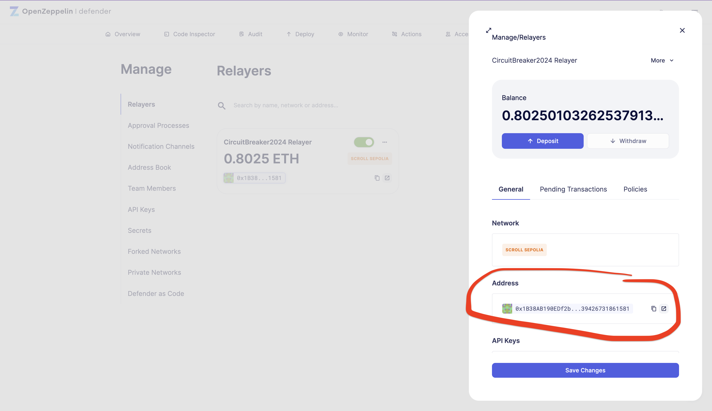

# IntmaxRepo

ステートレスなロールアップ INTMAX を調査・学習するためのリポジトリです。

## WalletSDK 用のサンプルアプリ起動方法

- リポジトリをクローンしてくる。

  ```bash
  git clone https://github.com/mashharuki/IntmaxRepo
  ```

- 事前準備

  1.  Scroll Sepolia の faucet を取得すること

      以下サイトで取得できます。

      - [learnweb3 Faucet](https://learnweb3.io/faucets/)
      - [ETHGlobal faucet](https://ethglobal.com/faucet)
      - [Scroll が紹介している faucet 用のサイト](https://docs.scroll.io/en/user-guide/faucet/)

      以上にアクセスして Faucet を取得すること！！

  2.  ScrollScan の API を取得すること

      デプロイしたコントラクトを Verify するのに使うので以下サイトにアクセスして API キーを作成する。

      [ScrollScan API Key](https://scrollscan.com/myapikey)

      

  3.  OpenZepplin Defender にログインして ScrollSepolia 上で Relayer を作成し、API キーを取得すること。

      [OpenZeppelin Defender Relayer](https://defender.openzeppelin.com/v2/#/manage/relayers)

      

  4.  上記で作成した Relayer のウォレットアドレスに少額の ETH を送金する(Scroll Sepolia 上で送金してください！！)。

      [OpenZeppelin Defender で作成した Relayer アドレス - ScrollScan](https://sepolia.scrollscan.dev/address/0x1B38AB190EDf2bb4BcB2EC0b6639426731861581)

      

      各作成した Relayer のアドレスが表示されているはずなのでそのアドレスに入金すること

  5.  環境変数の設定

           環境変数は`backend`と`frontend`でそれぞれ設定する。

           - backend 側の環境変数の設定

             `.env`ファイルを`backend`フォルダ配下に作成する。

             そして以下の環境変数を設定する。

             ```txt
              PRIVATE_KEY=
              SCROLLSCAN_API_KEY=
              DEFENDER_API_KEY=
              DEFENDER_SECRET_KEY=
             ```

             `PRIVATE_KEY`はMetamaskからコピペしてくる。

             `SCROLLSCAN_API_KEY`と`DEFENDER_API_KEY`と`DEFENDER_SECRET_KEY`は上記で取得してきたものを貼り付ける。

          - frontend側の環境変数の設定

            `.env.local`ファイルを`frontend`フォルダ配下に作成する。

            そして以下の環境変数を設定する。

            ```txt
              NEXT_PUBLIC_APP_ICON="https://intmaxwallet-sdk-wallet.vercel.app/vite.svg"
              NEXT_PUBLIC_WALLET_URL="https://intmaxwallet-sdk-wallet.vercel.app/"
              NEXT_PUBLIC_RPC_URL="https://sepolia-rpc.scroll.io/"
              DEFENDER_API_KEY=
              DEFENDER_SECRET_KEY=
            ```

            `DEFENDER_API_KEY`と`DEFENDER_SECRET_KEY`は上記で取得してきたものを貼り付ける。

- インストール

  ```bash
  yarn
  ```

- スマートコントラクトのコンパイル

  ```bash
  yarn backend compile
  ```

- スマートコントラクト　デプロイ

  ```bash
  yarn backend deploy --network scrollSepolia
  ```

  デプロイ済みコントラクト(ScrollSepolia)

  [SampleForwarder](https://sepolia.scrollscan.com/address/0x32F9d19A89b65F91da684ee25136CF692673A160#code)

  [HelloWorld](https://sepolia.scrollscan.com/address/0x5e86a9F80E4Dec74573fe75F62090Cb28a1B5760#code)

- 検証

  ```bash
  yarn backend verify --network scrollSepolia
  ```

- ガスレスでサンプルコントラクトの機能を呼び出す

  ```bash
  yarn backend gaslessSetNewText --network scrollSepolia
  ```

- コントラクトに保存されている Text の値を取得する。

  ```bash
  yarn backend getText --network scrollSepolia
  ```

- フロントエンドビルド

  ```bash
  yarn frontend build
  ```

- フロントエンド起動

  ```bash
  yarn fronend dev
  ```

## ソースコードの解説(INTMAX Wallet SDK に関する部分)

INTMAX Wallet SDK に関する実装は全て `pkgs/frontend/src/context/IntmaxProvider.tsx`にまとめてあります！！

このファイルには次の機能を実装しています。

1. SDK 用のインスタンスを生成するメソッド
2. connect するメソッド
3. トランザクションを送信するメソッド
4. ガスレスでトランザクションを送信するメソッド

5. の部分では`intmax-walletsdk/dapp`の`ethereumProvider`と`intmaxDappClient`を使って実装しています！！

```ts
/**
 * SDK用のインスタンスを生成するメソッド
 * @param walletUrl
 * @returns
 */
const createSdk = () => {
  setLoading(true);

  try {
    const client = intmaxDappClient({
      wallet: {
        url: DEFAULT_WALLET_URL,
        name: "DEMO Wallet",
        window: { mode: "iframe" }, // modeは iframeかpopupを選択できる
      },
      metadata: DAPP_METADATA,
      providers: {
        eip155: ethereumProvider({
          httpRpcUrls: {
            534351: RPC_URL, // 今回はScroll Sepoliaに接続するように設定
          },
        }),
      },
    });
    // SDK インスタンスをセット
    setSdk(client);
    return client;
  } catch (err: any) {
    console.error("err:", err);
  } finally {
    setLoading(false);
  }
};
```

これで connect する準備ができました！！

2. の部分については 1.で作成したインスタンスの機能を使って connect しています。  
   ※ 今回は同時に`eth_sign`API も呼び出して署名も実施するようにしています！

```ts
const sdk = createSdk();

const ethereum = sdk!.provider(`eip155:${CHAIN_ID}`);
// ウォレット情報を取得する。
await ethereum.request({ method: "eth_requestAccounts", params: [] });
const accounts = (await ethereum.request({
  method: "eth_accounts",
  params: [],
})) as string[];
console.log("Account Info:", accounts);
setAccounts(accounts);
setAddress(accounts[0]);

// ログイン時に署名
const result = await ethereum.request({
  method: "eth_sign",
  params: [accounts[0], "Hello INTMAX WalletSDK Sample Dapp!!"],
});
console.log(result);
```

3. についても同様に 1.で作成したインスタンスの機能を使ってトランザクションを送信することになります。

```ts
/**
 * トランザクションを送信するメソッド
 */
const sendTx = async (to: string, value: string) => {
  const ethereum = await sdk.provider(`eip155:${CHAIN_ID}`);

  setLoading(true);
  try {
    // send Simple Transaction
    const result = await ethereum.request({
      method: "eth_sendTransaction",
      params: [
        {
          from: address,
          to: to,
          value: parseEther(value),
        },
      ],
    });

    console.log("tx info:", `https://sepolia.etherscan.io/tx/${result}`);

    // .. 以下略
  } catch (err: any) {
    console.error("error:", err);
    // .. 以下略
  } finally {
    // .. 以下略
  }
};
```

4.についてもこれまでとほぼ同じ流れです。ここでは、メタトランザクションで使う署名データ生成のために`eth_signTypedData_v4`の API を呼び出しています。

残りの実装部分についてはメタトランザクションを実装する時のほぼ同じ流れです！！

```ts
/**
 * ガスレスでコントラクトのメソッドを呼び出す
 */
const gasslessRequest = async () => {
  console.log(
    "================================= [gasless: START] ================================="
  );

  const ethereum = await sdk.provider(`eip155:${CHAIN_ID}`);
  const provider = await new ethers.JsonRpcProvider(RPC_URL);

  setLoading(true);
  try {
    // create forwarder contract instance
    const forwarder: any = new Contract(
      FORWARDER_CONTRACT_ADDRESS,
      SampleForwarderJson.abi,
      provider
    ) as any;
    // create ScoreValut contract instance
    const helloWorld: any = new Contract(
      HELLOWORLD_CONTRACT_ADDRESS,
      HelloWorldJson.abi,
      provider
    ) as any;

    // 呼び出すメソッドのエンコードデータを用意
    // 今回は"hello INTMAXX!!"という文字列を引数にして HelloWorldコントラクトのsetNewTextメソッドを呼び出したいと思います！
    const encodedData: any = helloWorld.interface.encodeFunctionData(
      "setNewText",
      ["hello INTMAXX!!"]
    );

    // get domain
    const domain = await forwarder.eip712Domain();
    // get unit48
    const uint48Time = getUint48();

    console.log("encodedData:", encodedData);
    console.log("domain:", domain);
    console.log("uint48Time:", uint48Time);

    // test sign messages
    const typedData = {
      domain: {
        name: domain[1],
        version: domain[2],
        chainId: CHAIN_ID, // scroll sepolia
        verifyingContract: domain[4].toString(),
      },
      types: {
        ForwardRequest: ForwardRequest,
      },
      primaryType: "ForwardRequest",
      message: {
        from: address.toString(),
        to: HELLOWORLD_CONTRACT_ADDRESS.toString(),
        value: 0,
        gas: 360000,
        nonce: (await forwarder.nonces(address)).toString(),
        deadline: uint48Time.toString(),
        data: encodedData.toString(),
      },
    };

    // create request data
    // eth_signTypedData_v4 のAPIを使って署名データを作成
    const sig = await ethereum.request({
      method: "eth_signTypedData_v4",
      params: [address, JSON.stringify(typedData)],
    });

    console.log("sig:", sig);

    // call requestRelayer API
    const gaslessResult = await fetch("/api/requestRelayer", {
      method: "POST",
      headers: {
        "Content-Type": "application/json",
      },
      body: JSON.stringify({
        from: address,
        to: HELLOWORLD_CONTRACT_ADDRESS,
        value: 0,
        gas: 360000,
        nonce: (await forwarder.nonces(address!)).toString(),
        deadline: uint48Time.toString(),
        data: encodedData,
        signature: sig,
      }),
    });

    console.log(await gaslessResult.json());

    // .. 以下略
  } catch (err: any) {
    // .. 以下略
  } finally {
    // .. 以下略
  }
};
```

### 参考文献

以下参考にしたサイトや文献です！！

1. [Scaling Ethereum 2023](https://ethglobal.com/events/scaling2023/prizes/intmax-intmax-5ejin)
2. [GitHub - webmax.js Public](https://github.com/InternetMaximalism/webmax.js)
3. [Intmax Wallet](https://drive.google.com/file/d/16AcEheRMEtX9GgjOcQiFQZNQR8ZCPAS0/view)
4. [IntMax の公式サイト](https://intmax.io/)
5. [GetStarted](https://docs.testnet.intmax.io/getting-started/overview)
6. [Scroll bridge](https://scroll.io/bridge)
7. [CLI のガイドライン](https://docs.testnet.intmax.io/getting-started/interface-guide)
8. [intmax rolluo cli](https://github.com/InternetMaximalism/intmax-rollup-cli)
9. [hardhat-Plugin](https://github.com/mashharuki/intmax-interoperability-plugin)
10. [Sample-Auction-dapp](https://github.com/InternetMaximalism/intmax-rollup-cli/tree/main/packages/sample-auction-app/ethereum)
11. [PRTIMES - INTMAX Walletless Wallet](https://prtimes.jp/main/html/rd/p/000000004.000110841.html)
12. [INTMAX Wallet Home Page](https://home.wallet.intmax.io/)
13. [GitHub - intmax-walletsdk](https://github.com/InternetMaximalism/intmax-walletsdk)
14. [npm - INTMAX WalletSDK](https://www.npmjs.com/package/intmax-walletsdk)
15. [INTMAX WalletSDK サンプル実装](https://github.com/InternetMaximalism/intmax-walletsdk/blob/main/examples/dapp/src/App.tsx)
16. [INTMAX Wallet SDK - GitBook](https://intmax-wallet.gitbook.io/intmax-walletsdk)
17. [レイヤー 2「INTMAX」とは？真の金融インフラを開発する日置玲於奈氏の展望に迫る](https://meta-bank.jp/theme/intmax-hioki/)
18. [INTMAX、「Plasma Next」メイネット α をローンチ。Plasma の完成により拡張性向上](https://news.yahoo.co.jp/articles/741cb91f613971f44d91a8c982a5bf49bf955e4d)
19. [大衆向けイーサリアムのスケーリング: INTMAX が Plasma Next を発表](https://hackernoon.com/ja/%E5%A4%A7%E8%A1%86%E5%90%91%E3%81%91%E3%82%A4%E3%83%BC%E3%82%B5%E3%83%AA%E3%82%A2%E3%83%A0%E3%81%AE%E3%82%B9%E3%82%B1%E3%83%BC%E3%83%AA%E3%83%B3%E3%82%B0-intmax-%E3%81%8C%E6%AC%A1%E3%81%AB%E3%83%97%E3%83%A9%E3%82%BA%E3%83%9E%E3%82%92%E7%99%BA%E8%A1%A8)
20. [INTMAX ホワイトペーパー](https://eprint.iacr.org/2023/1082.pdf)
21. [Plasma Next: Plasma without Online Requirements](https://hackmd.io/@leonahioki/SJQixupj6)
